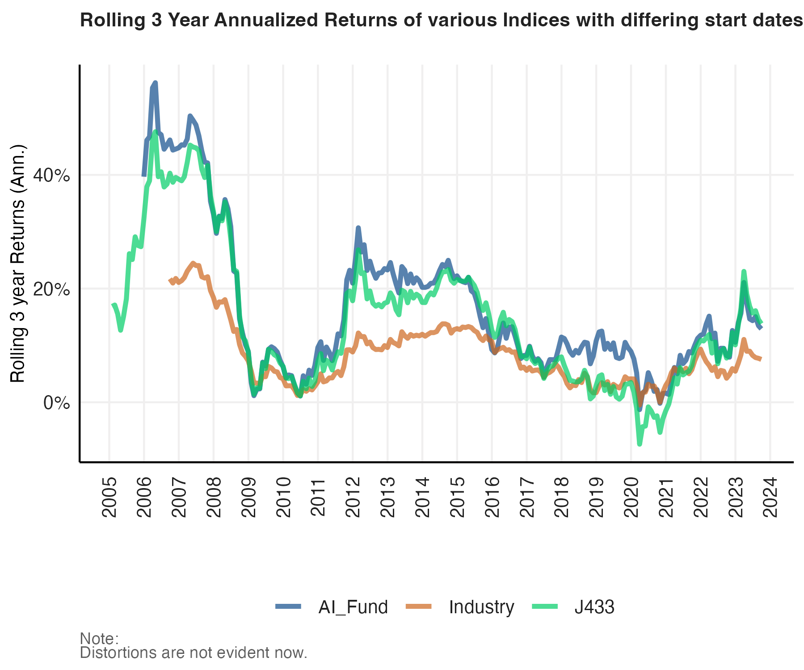
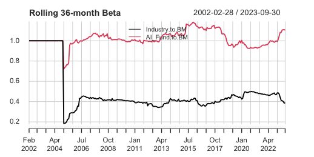

```{r setup, include=FALSE}
knitr::opts_chunk$set(echo = FALSE)
```

## Annualised Rolling Returns



The AI fund closely mirrors the benchmark compared to its industry peers.

## Rolling Betas



## Key Takeaway

The AI fund exhibits a close alignment with the benchmark in contrast to its industry counterparts. Although the rolling Beta of the AI Fund indicates higher volatility compared to the benchmark, which is typical for technology-oriented funds, the fund outperforms the industry. If the industry is actively managed and demonstrates lower volatility than the benchmark, this suggests that the AI Fund's performance remains superior despite its higher volatility. indicating the non-actively managed fund's ability to sustain its competitive edge.
