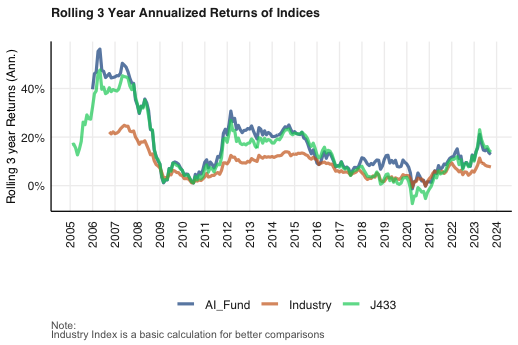

```{r setup, include=FALSE}
knitr::opts_chunk$set(echo = FALSE)
```

## Introduction

///

## Annualised Rolling Returns



We can see that the AI fund travks the benchmark much better than the comparitive actively managed industry funds

## Rolling Betas (benchmark)


## Rolling Betas (industry)


